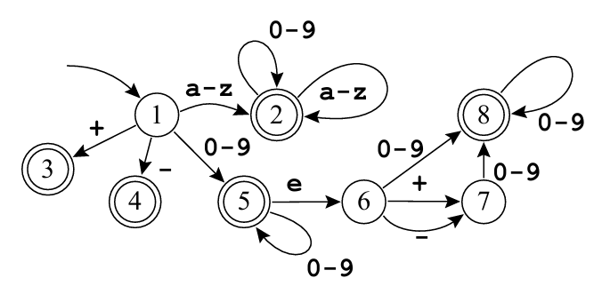

## Sobre o exercício
<p align="justify"> 
  Neste problema, escrevi um arquivo .l e, com a ferramenta Flex, pude gerar um analisador léxico que reconhece o seguinte autômato:
  

  O programa lê a partir da entrada padrão e imprime um token por linha, chegando ao fim ao encontrar o símbolo de fim de arquivo. Para caracteres que não façam parte do alfabeto, o programa imprime a mensagem ERRO. Quebras de linha são ignoradas. 
  
  Exemplo de entrada:

    ```bash
    +-abcabc@ abc
    fgh
    ```

    Sua respectiva saída:
    ```bash
    +
    abcabc
    ERRO
    ERRO
    abc
    fgh
    ```
</p>

## Como testar o programa

