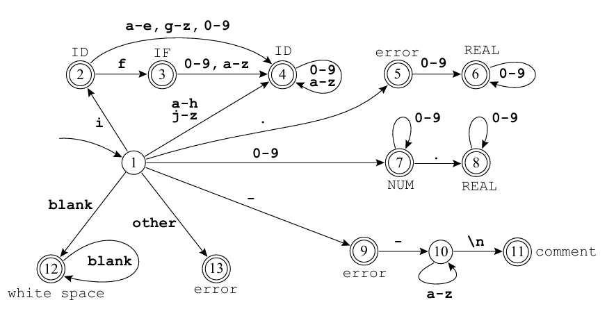

## 📝 Sobre o exercício

 
  Neste problema, também escrevi um arquivo .l e, com a ferramenta Flex, gerei um analisador léxico que reconhece o seguinte autômato:

  

 
  O programa lê a partir da entrada padrão e imprime um token por linha, chegando ao fim ao encontrar o símbolo de fim de arquivo. Para caracteres que não façam parte do alfabeto, o programa imprime a mensagem 'error'. Quebras de linha que não estão associadas ao token 'comment' são ignoradas.  

  Exemplo de entrada:
  
      identificador 900abobrinha@--comentario
      0.0

   

    Sua respectiva saída:
  
      identificador ID
      white space
      900 NUM
      abobrinha ID
      @ error
      --comentario comment
      0.0 REAL

## 📄 Conteúdo

- `analisador-02.l`: Arquivo Flex com as definições, regras e código auxiliar em C.
- `Makefile`: O Makefile nos ajuda a compilar o programa com maior praticidade.
- `entrada-exemplo.txt`: Este txt contém um exemplo de entrada que poderemos usar para rodar o programa.

## ⚙️ Como testar o programa
1. Execute o comando 'make' na pasta com os três arquivos a partir do cmd.
2. Um programa.exe será gerado automaticamente, portanto execute o comando 'programa.exe < entrada-exemplo.txt'
